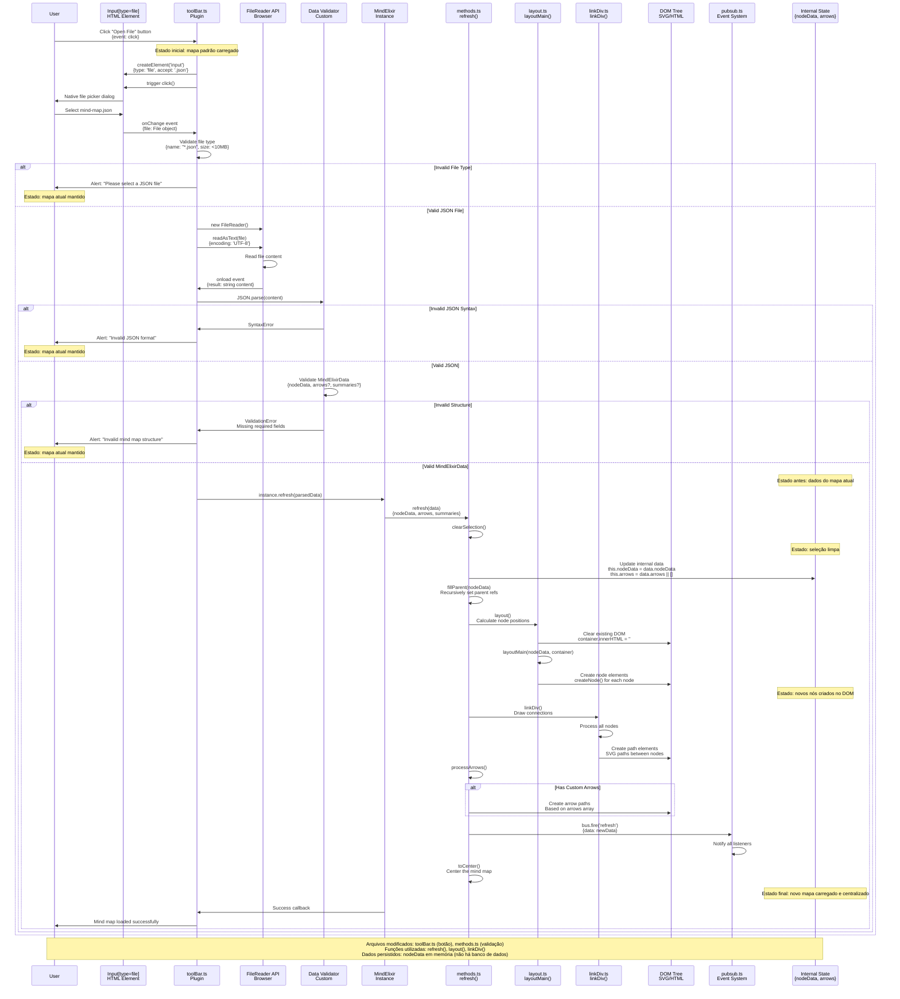

# Diagrama de Sequência - Abertura de Arquivos de Mapas Mentais

## Fluxo de Abertura de Arquivo JSON



## Estados do Sistema Durante o Processo

### 1. Estado Inicial
- Mapa mental padrão carregado
- ToolBar visível com botões existentes
- Nenhuma operação em andamento

### 2. Estado Durante Seleção de Arquivo
- Dialog nativo do browser aberto
- Aplicação aguardando resposta do usuário
- Mapa atual ainda visível

### 3. Estado Durante Leitura
- FileReader processando arquivo
- UI pode mostrar indicador de carregamento
- Mapa atual ainda visível

### 4. Estado Durante Validação
- Conteúdo JSON sendo parseado
- Estrutura sendo validada
- Decisão sobre aceitar ou rejeitar dados

### 5. Estado Durante Atualização
- DOM sendo limpo
- Novos elementos sendo criados
- Conexões sendo desenhadas

### 6. Estado Final (Sucesso)
- Novo mapa completamente carregado
- Centralizado na viewport
- Pronto para edição

### 6. Estado Final (Erro)
- Mapa original mantido
- Mensagem de erro exibida
- Sistema pronto para nova tentativa

## Detalhes de Implementação

### Arquivos a Modificar:
1. **src/plugin/toolBar.ts**
   - Adicionar botão "Open File"
   - Implementar handler para file input
   - Adicionar validação de arquivo

2. **src/icons/** (novo arquivo)
   - folder-open.svg para ícone do botão

3. **src/i18n.ts**
   - Adicionar traduções para "Open File"
   - Mensagens de erro em múltiplos idiomas

### Funções Reutilizadas:
1. **refresh(data)** - Atualiza mapa com novos dados
2. **clearSelection()** - Limpa seleções atuais
3. **fillParent()** - Configura referências parent/child
4. **layout()** - Calcula posições dos nós
5. **linkDiv()** - Desenha conexões
6. **toCenter()** - Centraliza visualização

### Estrutura de Dados Esperada:
```typescript
interface MindElixirData {
  nodeData: {
    id: string
    topic: string
    root: boolean
    children?: NodeObj[]
  }
  arrows?: Array<{
    id: string
    from: string
    to: string
    text?: string
  }>
  summaries?: Array<{
    id: string
    from: string
    to: string
    text?: string
  }>
  direction?: 0 | 1 | 2
  theme?: Theme
}
```