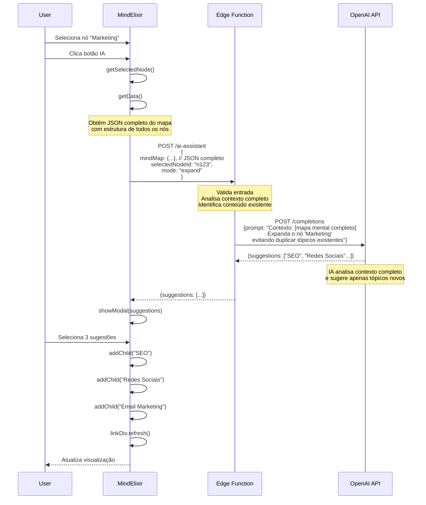
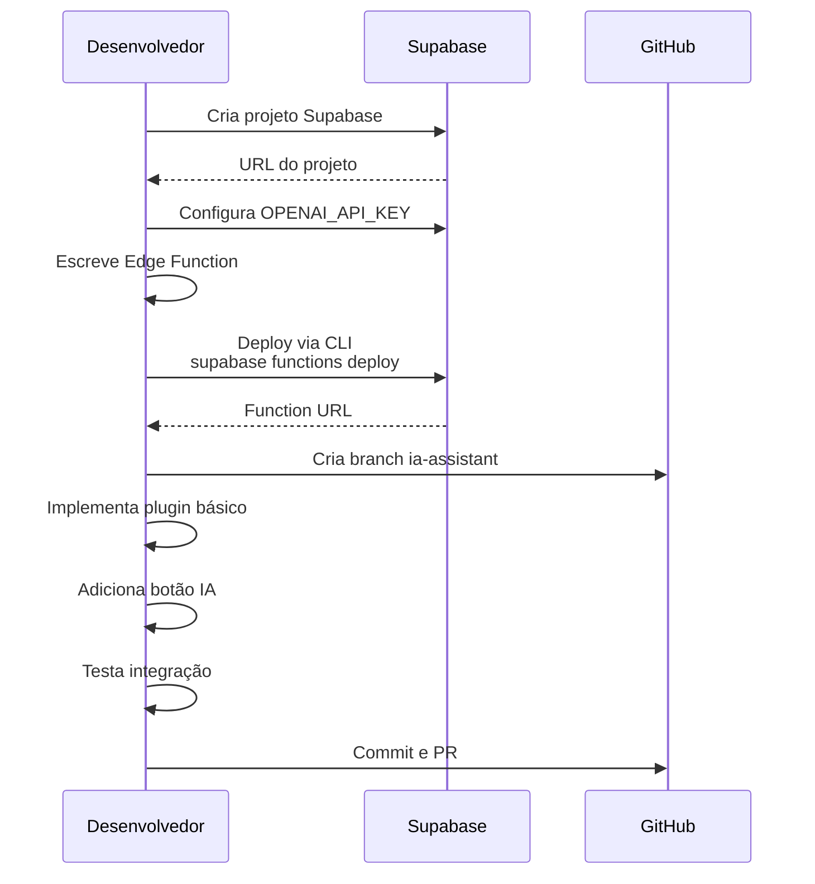
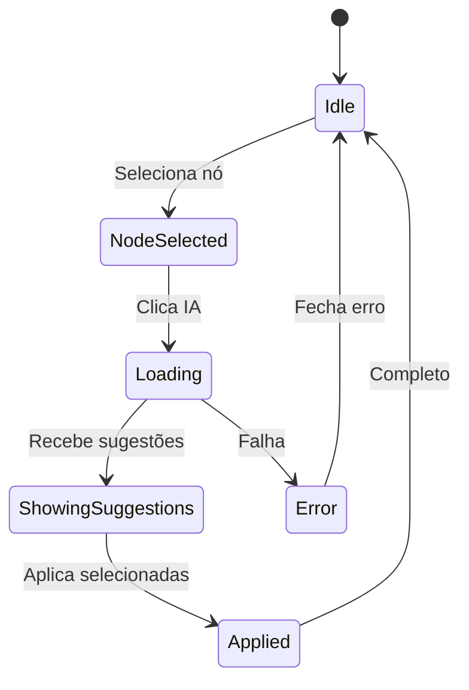
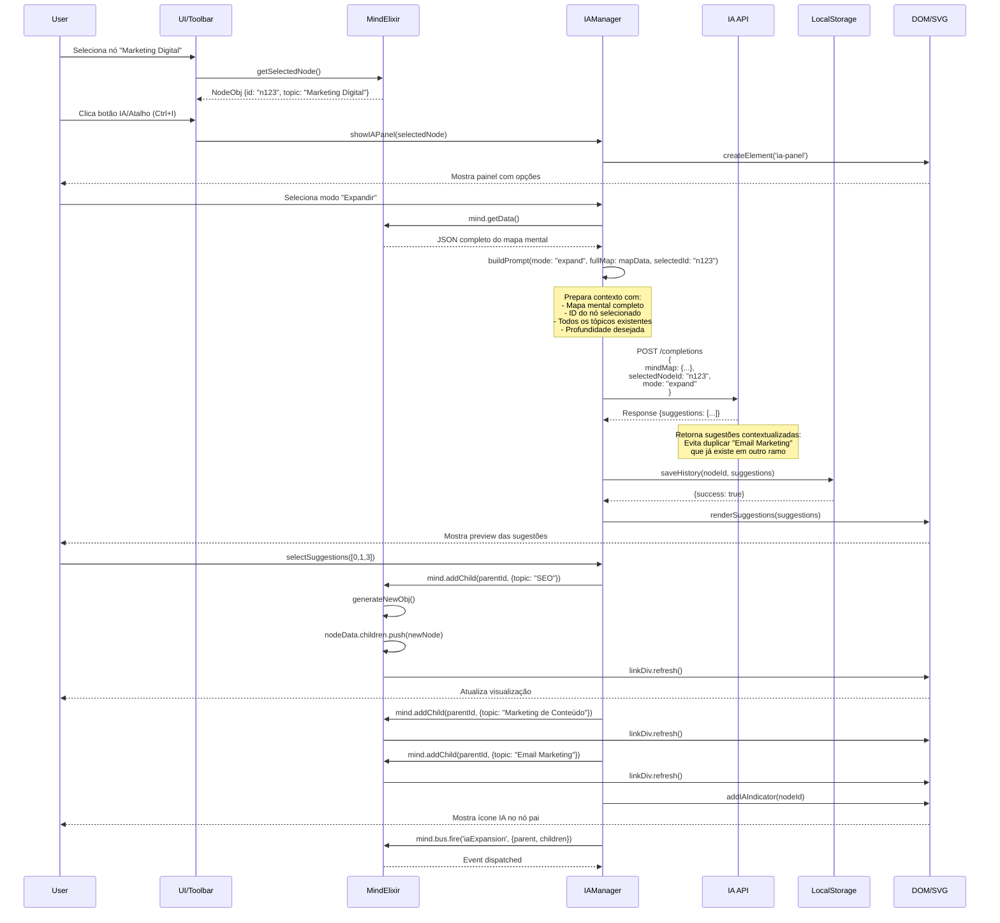
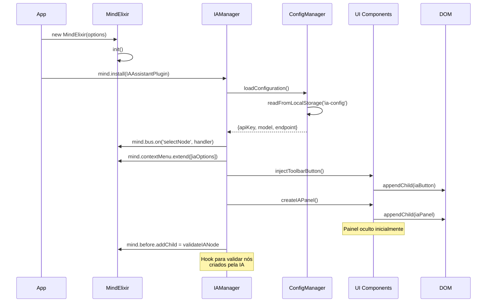
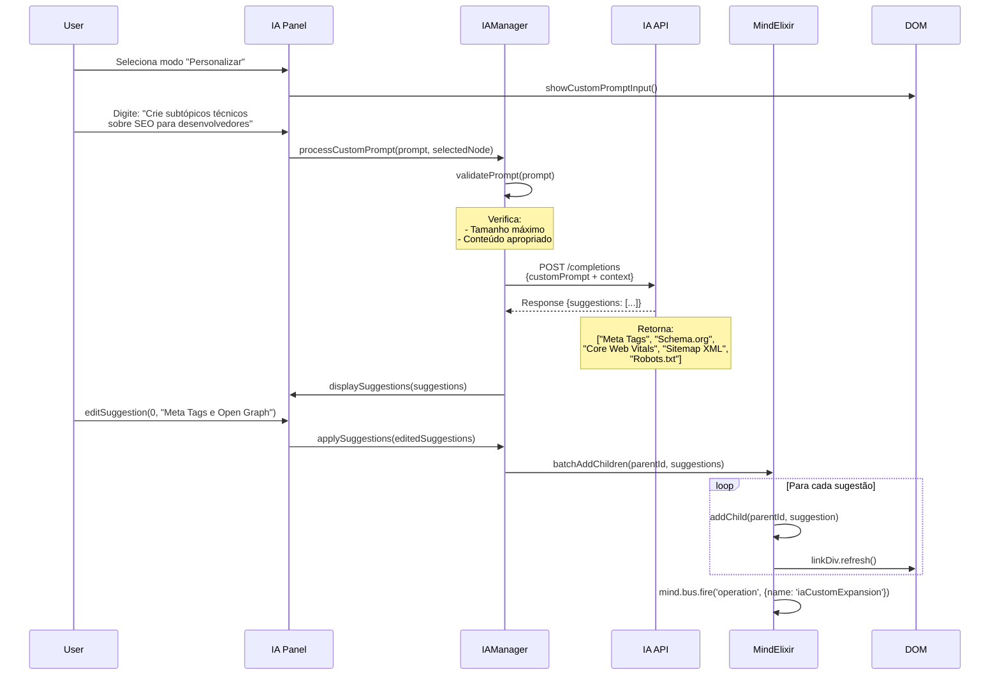
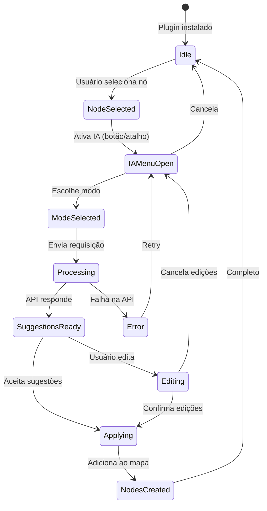

# Diagrama de Sequência - IA Assistant (Simplificado)

## Fluxo Simplificado com Supabase Edge Functions



## Fluxo de Implementação MVP



## Estados Simplificados



## Fluxo de Expansão de Tópico com IA



## Fluxo de Configuração e Inicialização



## Fluxo de Personalização com Prompt Customizado



## Estados e Transições



## Tabelas de Persistência

### LocalStorage - Configuração IA
```
Key: "mindmap-ia-config"
Value: {
    apiKey: string (encrypted),
    apiEndpoint: string,
    model: string,
    temperature: number,
    maxTokens: number,
    defaultMode: string,
    language: string
}
```

### LocalStorage - Histórico de Sugestões
```
Key: "mindmap-ia-history-{mapId}"
Value: {
    "{nodeId}": {
        timestamp: number,
        mode: string,
        prompt?: string,
        suggestions: string[],
        accepted: string[],
        rejected: string[]
    }
}
```

### LocalStorage - Indicadores IA
```
Key: "mindmap-ia-nodes-{mapId}"
Value: {
    iaGeneratedNodes: string[], // IDs dos nós
    metadata: {
        "{nodeId}": {
            generatedAt: number,
            mode: string,
            parentContext: string
        }
    }
}
```