# Diagrama de Sequência - IA Assistant

## Fluxo Simplificado com Supabase Edge Functions


## Fluxo de Implementação MVP

```mermaid
sequenceDiagram
    participant Dev as Desenvolvedor
    participant SB as Supabase
    participant GH as GitHub

    Dev->>SB: Cria projeto Supabase
    SB-->>Dev: URL do projeto
    
    Dev->>SB: Configura OPENAI_API_KEY
    Dev->>Dev: Escreve Edge Function
    Dev->>SB: Deploy via CLI<br/>supabase functions deploy
    
    SB-->>Dev: Function URL
    
    Dev->>GH: Cria branch ia-assistant
    Dev->>Dev: Implementa plugin básico
    Dev->>Dev: Adiciona botão IA
    Dev->>Dev: Testa integração
    
    Dev->>GH: Commit e PR
```



## Estados Simplificados

```mermaid
stateDiagram-v2
    [*] --> Idle
    Idle --> NodeSelected: Seleciona nó
    NodeSelected --> Loading: Clica IA
    Loading --> ShowingSuggestions: Recebe sugestões
    Loading --> Error: Falha
    ShowingSuggestions --> Applied: Aplica selecionadas
    Applied --> Idle: Completo
    Error --> Idle: Fecha erro
```



## Fluxo de Expansão de Tópico com IA

```mermaid
sequenceDiagram
    participant User
    participant UI as UI/Toolbar
    participant ME as MindElixir
    participant IAM as IAManager
    participant API as IA API
    participant DOM as DOM/SVG

    User->>UI: Seleciona nó "Marketing Digital"
    UI->>ME: getSelectedNode()
    ME-->>UI: NodeObj {id: "n123", topic: "Marketing Digital"}
    
    User->>UI: Clica botão IA/Atalho (Ctrl+I)
    UI->>IAM: showIAPanel(selectedNode)
    IAM->>DOM: createElement('ia-panel')
    DOM-->>User: Mostra painel com opções
    
    User->>IAM: Seleciona modo "Expandir"
    User->>IAM: Clica botão "Gerar"
    IAM->>ME: mind.getData()
    ME-->>IAM: JSON completo do mapa mental
    IAM->>IAM: cleanNodeData(nodeData)
    Note over IAM: Remove referências circulares<br/>para evitar erro de JSON
    
    IAM->>API: POST /ai-assistant<br/>{<br/>  mindMap: {...},<br/>  selectedNodeId: "n123",<br/>  mode: "expand"<br/>}
    API-->>IAM: Response {<br/>  children: [<br/>    {topic: "SEO", aiGenerated: true},<br/>    {topic: "Redes Sociais", aiGenerated: true},<br/>    {topic: "Analytics", aiGenerated: true}<br/>  ]<br/>}
    Note over API: Retorna estrutura de nós<br/>pronta para adicionar<br/>Evita duplicar tópicos existentes
    
    IAM->>IAM: addAINodes(currentNode, children)
    loop Para cada nó filho
        IAM->>ME: mind.generateNewObj()
        ME-->>IAM: newNode
        IAM->>IAM: newNode.topic = child.topic<br/>newNode.aiGenerated = true<br/>newNode.aiGeneratedAt = ISO timestamp
        IAM->>ME: mind.addChild(parentEl, newNode)
        IAM->>DOM: Adiciona classe 'ai-generated-node'
        IAM->>DOM: Adiciona badge 🤖
    end
    
    ME->>DOM: linkDiv.refresh()
    DOM-->>User: Atualiza visualização
    
    IAM->>DOM: showSuccessMessage("3 nós foram adicionados")
    DOM-->>User: ✅ 3 nós foram adicionados com sucesso!
```



## Fluxo de Configuração e Inicialização

```mermaid
sequenceDiagram
    participant App
    participant ME as MindElixir
    participant IAM as IAManager
    participant Config as ConfigManager
    participant UI as UI Components

    App->>ME: new MindElixir(options)
    ME->>ME: init()
    
    App->>IAM: mind.install(IAAssistantPlugin)
    IAM->>Config: loadConfiguration()
    Config->>Config: readFromLocalStorage('ia-config')
    Config-->>IAM: {apiKey, model, endpoint}
    
    IAM->>ME: mind.bus.on('selectNode', handler)
    IAM->>ME: mind.contextMenu.extend([iaOptions])
    
    IAM->>UI: injectToolbarButton()
    UI->>DOM: appendChild(iaButton)
    
    IAM->>UI: createIAPanel()
    UI->>DOM: appendChild(iaPanel)
    Note over UI: Painel oculto inicialmente
    
    IAM->>ME: mind.before.addChild = validateIANode
    Note over IAM: Hook para validar nós<br/>criados pela IA
```



## Fluxo de Personalização com Prompt Customizado


## Fluxo do Modo Question (Perguntas com Respostas)

```mermaid
sequenceDiagram
    participant User
    participant IAP as IA Panel
    participant IAM as IAManager
    participant API as IA API
    participant ME as MindElixir

    User->>IAP: Seleciona modo "Perguntas"
    User->>IAP: Define número de perguntas (ex: 3)
    IAP->>IAM: generateQuestions(selectedNode, count=3)
    
    IAM->>API: POST /ai-assistant<br/>{<br/>  mode: "question",<br/>  selectedNodeId: "n123",<br/>  depth: 3<br/>}
    
    Note over API: Gera perguntas e respostas<br/>sobre o tópico selecionado
    
    API-->>IAM: Response {<br/>  questionsWithAnswers: [<br/>    {<br/>      question: "O que é Marketing Digital?",<br/>      answer: "É o conjunto de estratégias...",<br/>    },<br/>    {<br/>      question: "Quais são os principais canais?",<br/>      answer: "Os principais canais incluem...",<br/>    },<br/>    {<br/>      question: "Como medir o ROI?",<br/>      answer: "O ROI pode ser medido através...",<br/>    }<br/>  ]<br/>}
    
    IAM->>IAP: displayQuestionsWithAnswers(questionsWithAnswers)
    User->>IAP: selectQuestions([0, 2])
    
    IAP->>IAM: applyQuestionsWithAnswers(selected)
    
    loop Para cada pergunta selecionada
        Note over IAM: Cria estrutura pai-filho
        IAM->>ME: addChild(parentId, {<br/>  topic: question,<br/>  aiGenerated: true<br/>})
        ME-->>IAM: questionNode
        
        IAM->>ME: addChild(questionNode.id, {<br/>  topic: answer,<br/>  aiGenerated: true<br/>})
        
        ME->>DOM: linkDiv.refresh()
    end
    
    Note over ME: Estrutura resultante:<br/>Marketing Digital<br/>├── O que é Marketing Digital? 🤖<br/>│   └── É o conjunto de estratégias... 🤖<br/>└── Como medir o ROI? 🤖<br/>    └── O ROI pode ser medido através... 🤖
```



## Estados e Transições

```mermaid
stateDiagram-v2
    [*] --> Idle: Plugin instalado
    
    Idle --> NodeSelected: Usuário seleciona nó
    NodeSelected --> IAMenuOpen: Ativa IA (botão/atalho)
    
    IAMenuOpen --> ModeSelected: Escolhe modo
    ModeSelected --> Processing: Envia requisição
    
    Processing --> SuggestionsReady: API responde (expand/custom)
    Processing --> QuestionsReady: API responde (question)
    Processing --> Error: Falha na API
    
    SuggestionsReady --> Editing: Usuário edita
    SuggestionsReady --> Applying: Aceita sugestões
    
    QuestionsReady --> SelectingQuestions: Usuário seleciona perguntas
    SelectingQuestions --> ApplyingQuestions: Confirma seleção
    
    Editing --> Applying: Confirma edições
    Applying --> NodesCreated: Adiciona ao mapa
    ApplyingQuestions --> NodesWithAnswersCreated: Adiciona perguntas e respostas
    
    NodesCreated --> Idle: Completo
    NodesWithAnswersCreated --> Idle: Completo com estrutura Q&A
    Error --> IAMenuOpen: Retry
    
    IAMenuOpen --> Idle: Cancela
    Editing --> IAMenuOpen: Cancela edições
```



## Tabelas de Persistência

### LocalStorage - Configuração IA
```
Key: "mindmap-ia-config"
Value: {
    apiKey: string (encrypted),
    apiEndpoint: string,
    model: string,
    temperature: number,
    maxTokens: number,
    defaultMode: string,
    language: string
}
```

### LocalStorage - Histórico de Sugestões
```
Key: "mindmap-ia-history-{mapId}"
Value: {
    "{nodeId}": {
        timestamp: number,
        mode: string,
        prompt?: string,
        suggestions: string[],
        accepted: string[],
        rejected: string[]
    }
}
```

### LocalStorage - Indicadores IA
```
Key: "mindmap-ia-nodes-{mapId}"
Value: {
    iaGeneratedNodes: string[], // IDs dos nós
    metadata: {
        "{nodeId}": {
            generatedAt: number,
            mode: string,
            parentContext: string
        }
    }
}
```