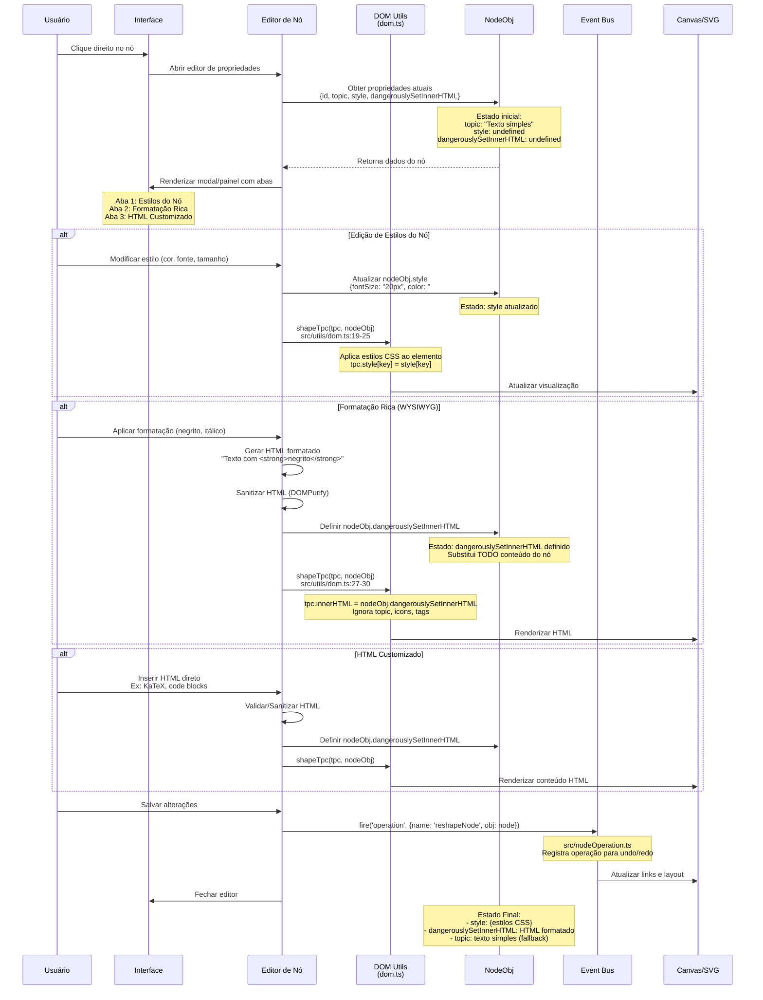

# Diagrama de Sequência - Editor de Propriedades do Nó com Estilos e Formatação

## Caso de Uso: Editar estilos e formatação de texto do nó



## Estados do Nó Durante a Edição

### Estado Inicial
```javascript
{
  topic: "Texto do nó",
  style: undefined,
  dangerouslySetInnerHTML: undefined
}
```

### Estado Durante Edição de Estilos
```javascript
{
  topic: "Texto do nó",
  style: {
    fontSize: "20px",
    color: "#333",
    fontWeight: "bold",
    background: "#f0f0f0",
    border: "2px solid blue"
  }
}
// Renderização: textContent com CSS aplicado
```

### Estado Durante Formatação Rica
```javascript
{
  topic: "Texto do nó", // mantido como fallback
  dangerouslySetInnerHTML: "<span>Texto com <strong>negrito</strong> e <em>itálico</em></span>"
}
// Renderização: innerHTML substitui TODO conteúdo
```

### Exemplos de dangerouslySetInnerHTML
```javascript
// KaTeX Math
dangerouslySetInnerHTML: '<div class="math math-display"><span class="katex">...</span></div>'

// Code Block
dangerouslySetInnerHTML: '<pre class="language-javascript"><code>let x = 1;</code></pre>'

// Custom Styled
dangerouslySetInnerHTML: '<div><style>.title{font-size:50px}</style><div class="title">Title</div></div>'
```

## Arquivos e Funções Principais

### src/utils/dom.ts
- `shapeTpc(tpc, nodeObj)`: Renderiza conteúdo do nó
  - Linhas 19-25: Aplica nodeObj.style
  - Linhas 27-30: Aplica dangerouslySetInnerHTML
  - Linha 52: Renderiza texto normal via textContent
- `editTopic()`: Editor inline (plaintext-only)
  - Linha 147: contentEditable = 'plaintext-only'

### src/nodeOperation.ts
- `reshapeNode(nodeId, updates)`: Atualiza propriedades do nó
- Registra operação no histórico

### src/types/index.ts
- `NodeObj`: Interface com style e dangerouslySetInnerHTML
- `NodeStyle`: Propriedades CSS suportadas

## Considerações de Segurança

### Risco XSS com dangerouslySetInnerHTML
```javascript
// PERIGOSO - sem sanitização
nodeObj.dangerouslySetInnerHTML = userInput // ⚠️ XSS!

// SEGURO - com sanitização
import DOMPurify from 'dompurify'
nodeObj.dangerouslySetInnerHTML = DOMPurify.sanitize(userInput)
```

### Editor Plaintext
- `contentEditable='plaintext-only'` previne injeção HTML
- Seguro para entrada de usuário

## Persistência e Exportação

- **Memória**: Alterações em instance.nodeData
- **Histórico**: Operações em instance.history[]
- **Exportação**: style e dangerouslySetInnerHTML incluídos em getData()
- **SVG Export**: foreignObject preserva HTML formatado