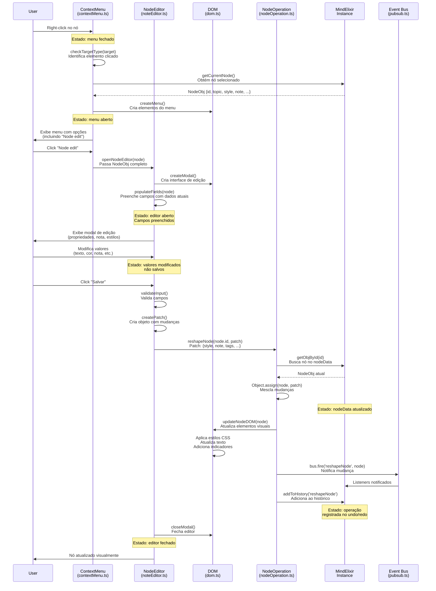

# Diagrama de Sequência - Edição de Nó

## Caso de Uso: Editar propriedades de um nó através do menu de contexto



## Estados e Dados Trocados

### Dados enviados para NodeEditor:
```javascript
{
  id: "node123",
  topic: "Texto do nó",
  style: {
    fontSize: "16px",
    color: "#333",
    background: "#fff"
  },
  note: "Conteúdo da nota...",
  tags: ["tag1", "tag2"],
  icons: ["icon1"],
  hyperLink: "https://...",
  branchColor: "#4285F4"
}
```

### Patch enviado para reshapeNode:
```javascript
{
  topic: "Novo texto",
  style: {
    color: "#000",
    background: "#f0f0f0"
  },
  note: "Nova nota expandida...",
  tags: ["tag1", "tag3", "nova"]
}
```

### Evento disparado:
```javascript
bus.fire('reshapeNode', {
  node: updatedNode,
  patch: appliedPatch
})
```

## Arquivos e Funções Percorridas

1. **contextMenu.ts**
   - `checkTargetType()`: Identifica elemento clicado
   - `createContextMenu()`: Cria menu contextual
   - `extend[].onclick()`: Handler para "Node edit"

2. **noteEditor.ts** (a ser criado)
   - `openNodeEditor()`: Abre modal de edição
   - `createModal()`: Cria elementos da UI
   - `populateFields()`: Preenche campos
   - `validateInput()`: Valida entradas
   - `saveChanges()`: Processa salvamento

3. **nodeOperation.ts**
   - `reshapeNode()`: Aplica mudanças ao nó
   - Validação de permissões (before hook)

4. **dom.ts**
   - `updateNodeDOM()`: Atualiza visualização
   - Aplicação de estilos inline
   - Atualização de indicadores visuais

5. **pubsub.ts**
   - `bus.fire()`: Dispara eventos
   - Notificação para plugins e listeners

## Persistência

- **Memória**: Alterações salvas em `instance.nodeData`
- **Histórico**: Operação salva em `instance.history[]` para undo/redo
- **Exportação**: Dados incluídos ao exportar via `getData()`
- **Não há persistência em banco de dados** (aplicação client-side)