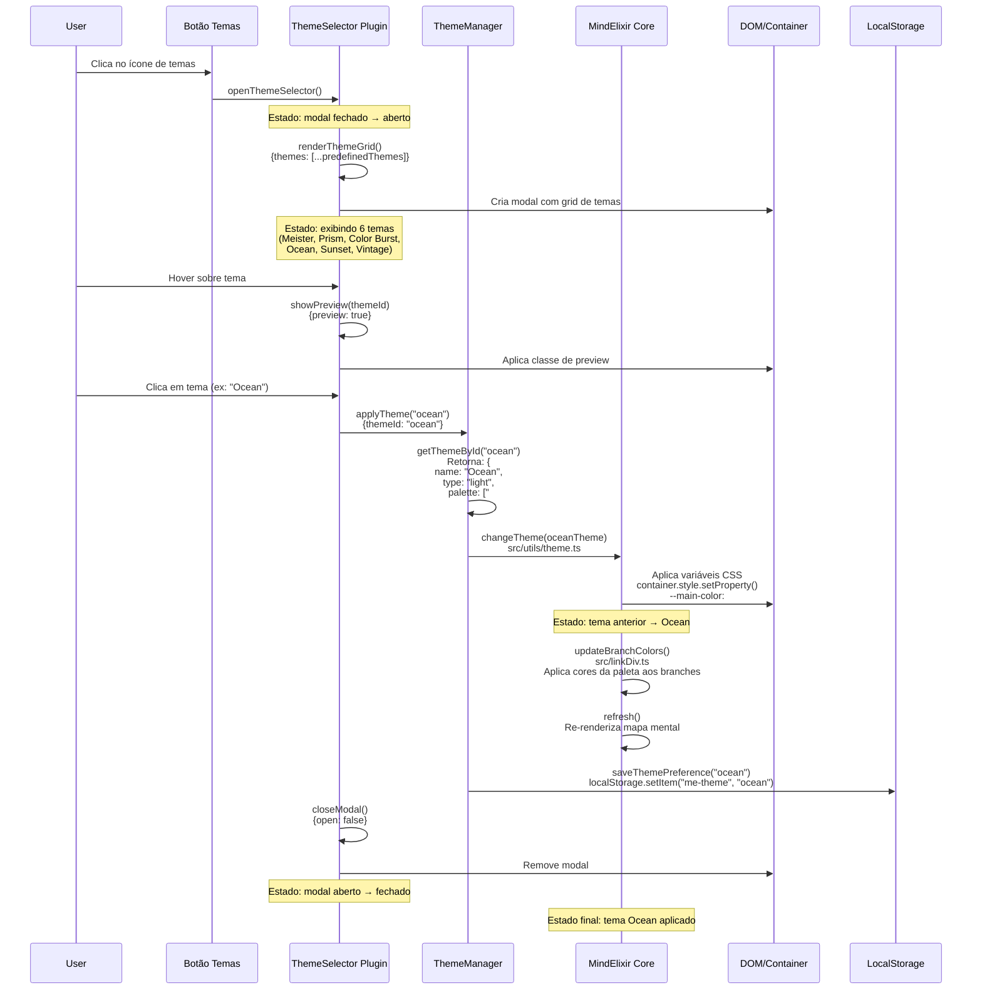

# Diagrama de Sequência - Aplicação de Temas

## Fluxo de Seleção e Aplicação de Tema

## Notas sobre o Fluxo:

- **Arquivos envolvidos**:
  - `src/plugin/themeSelector.ts` - Plugin de seleção de temas (a criar)
  - `src/utils/theme.ts` - Função changeTheme existente
  - `src/themes/index.ts` - Definições de temas predefinidos (a criar)
  - `src/linkDiv.ts` - Aplicação de cores nos branches
  - `src/index.ts` - Core do MindElixir

- **Estados rastreados**:
  - Modal do seletor: fechado → aberto → fechado
  - Tema ativo: tema anterior → novo tema
  - Preview: ativo/inativo durante hover

- **Dados persistidos**:
  - Preferência de tema no localStorage
  - Tema incluído ao exportar mapa mental (já existente)